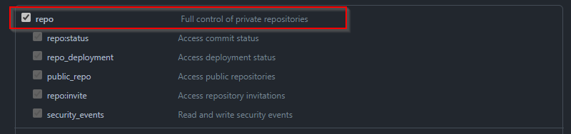
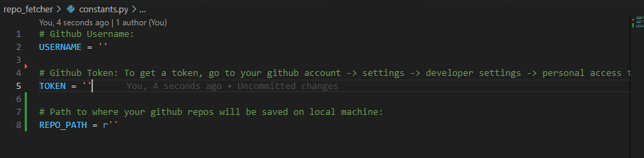

# GitHub Repo Fetcher

Summary: Github Repo Fetcher,  fetches all github repositories associated with a user account and saves them to a folder on the local machine.

- It is a Python script that automates the process of fetching and cloning all of your GitHub repositories public and private to a directory of your choice on your local machine. It utilizes the GitHub API along with your GitHub username and personal access token for authentication.
____

### Features
- Fetches all repositories associated with your GitHub account.
- Clones repositories to a specified directory on your local machine.
- Skips cloning if the repository already exists locally.
- Provides feedback on the success or failure of the fetch and clone operations.

____

### Prerequisites

Before using GitHub Repo Fetcher, you need to:

- Github Username

- Obtain a GitHub personal access token: [Creating a personal access token](https://docs.github.com/en/authentication/keeping-your-account-and-data-secure/managing-your-personal-access-tokens#creating-a-personal-access-token-classic)

- Give your token full control over private repositories: So check the `repo` scope when creating the token.
____

<p align="center">
  
</p>


- Install Python 3.x on your system.
_____

### Usage
_____

1. Clone this repository
2. Modify the constants.py file to include your GitHub username, personal access token, and the path where you want to save the repositories in your local filesystem.
______
<p align="center">
  
</p>

_____

3. Run the script using Python: 

```bash
python fetch_repos.py
```

_____

### Contributions
_____

- Github API: [GitHub API](https://docs.github.com/en/rest)
- Request to list all public repositories:  curl https://api.github.com/users/AbduAwad/repos
- Request to list all repos pub/priv: curl -u username:token https://api.github.com/user/repos
- For only private repos: curl -u username:token https://api.github.com/user/repos?visibility=private
- For only public repos: curl -u username:token https://api.github.com/user/repos?visibility=public
- For repos you are a collaborator on: curl -u username:token https://api.github.com/user/repos?affiliation=collaborator